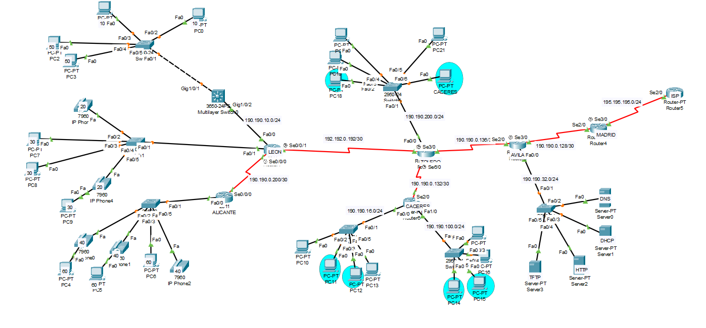

# Guía para Configurar una Red en Packet Tracer

## Topología de la Red  
A continuación, se muestra la topología que vamos a utilizar, incluyendo sus respectivas **IPs**, **nombres** y **servicios**:  

> 

---

# Configuración de Direcciones IP  
El primer paso será asignar las diferentes **IPs** a las interfaces del router.  

---

## Pasos a seguir:  

### 1. Entrar en el terminal del router  
Accede al terminal del dispositivo en Packet Tracer desde la pestaña de CLI en el router.

### 2. Acceder al modo EXEC privilegiado  
Escribe el siguiente comando:  
`enable ` 

### 3. Acceder al modo configuración global  
Escribiendo lo siguiente:  
`configure terminal`  

### 4. Acceder al a interfaz 
Elige la interfaz que deseas configurar. Por ejemplo para la iterfaz fa0/0,  utiliza:  
```interface fa0/0```  

### 5. Asignar una direccion IP  
Debes asignar una IP adecuada. Si la direccion de red es 190.190.16.0, la primera IP disponible será la 190.190.16.1, que funcionara como default gateway para los dispositivos finales.  
Usa el siguiente comando para asignar la IP con su mascara de subred (/24):  
`ip address 190.190.16.1 255.255.255.0`  

### 6.Activar la interfaz  
Por defecto las interfaces estan apagadas, debemos activarlas, cuando lo hagamos en la topología la interfaz aparecerá en verde. Usando:  
`no shutdown`  

>_Usa una mascara de subred consistente en toda la topología en este caso solo utilizaremos la mascara /24_  

>_Sigue configurando cada interfaz de manera individual utilizando direcciones IPs distintas.  (Si en un extremo configuramos la "x.x.x.1", en el otro sera la "x.x.x.2")_  

>_No Asignar IPs en las interfaces donde no hay IPs escritas en la topología, se configurarán VLanss mas tarde_  


---  

# Configuración de servicios de los servidores  

---

En este paso configuraremos los servicios que pueden prestar los servidores como DHCP, DNS, TFTP, HTTP.  

## Pasos a seguir:  

### 1.Asignar IP a los servidores  
Abre la pestaña de "Desktop" y dentro de Desktop la pestaña de "IP Configuration" y asignaremos una IP a cada servidor.  
_Por ejemplo si la red es 190.190.32.0. La puerta de enlace predeterminada será 190.190.32.1 y deberemos asignar IPs a partir de esa._

### 2. Activar el servicio
Después de asignar una IP, deberemos acivar el servicio, entrando en la pestaña del servicies y seleccionar el que deseemos.  

### 3. Crear el servicio  
En este paso configuraremos varios servicios:  

>HTTP: Para poder configurar el servicio HTTP. Deberemos entrar en el servicio de pone HTTP y al entrer debemos asegurarnos de que esta en "on". Los archivos que verás son los archivos de la página que se va a mostrar al abrir tu servicio HTTP o HTTPS  

>DNS: Para poder configurar el servicio DNS debemos acceder a la pestaña de DNS y deberemos agregarle un nombre(nosotros pondermos www.dyla.com) donde pone name y la IP del servidor HTTP en el espacio de "Address" que en nuetro caso es(190.190.32.4), Para que nos traduzca "www.dylan.com" a la IP del servidor HTTP y nos mostrará la página de la que hablaba antes.  

>TFTP: Para poder configurar el servicio TFTP que funcionará com almacén o repositorio de firmware y de archivos de configuración, como podría ser la NVRam del router, deberemos entrar en el apartado de TFTP y comprobar que esta activado. [Aquí podras ver como utilizarlo](./Cheatsheet.md). O más adelante junto con la guía.

>DHCP: Lo dejaremos para más adelante. Para poder seguir con la guía paso por paso.


---  
  
# Creación de VLANs  
El siguiente paso será la creación de las VLAN. Estas tendrán que ser creadas en switchs de capa de enlace de datos(2) y switch de capa de red(3).  

---  

## Pasos a seguir:  

### 1. Entrar en el terminal de configuracion del switch de capa 2
Entrar desde la pestaña de CLI del menu del switch capa 2  

### 2. Acceder al modo EXEC privilegiado  
Escribe el siguiente comando:  
`enable`  

### 3. Acceder al modo configuración global  
Escribiendo lo siguiente:  
`configure terminal`  

### 4. Crear las VLAN
En los switches deben estar creadas todas las VLAN de su misma red para identificar a que dispositivo enviar el paquete. para crear las VLAN  10, 50, 20, 30, 40 y 60. Las VLAN 20 y 40 son VLANs para la telefonía IP por lo que se configurarán diferentes.  
_"Recordemos que los routers dividen redes"_   
Para crearlas escrirbe:  
__switch1__  
`vlan 10`  
`vlan 50`  
__switch2__  
`vlan 20`  
`vlan 30`  
__switch3__  
`vlan 40`  
`vlan 60`  

### 5. Mode Trunk  
Esto es una opción que permite que todas las vlan viajen por un medio sin que tenga que formar parte de la VLAN, esto se aplica en las interfaces entre switches o a las que van a los routers para permitir viajar a loas paquetes con:  
`switchport mode trunk`

### 6. Asignar VLAN a los puertos   
Para que los dispositivos finales tengan una VLAN asignada por ejemplo el pc0 con la VLAN 10:  
`switchport mode access`  
`switchport access vlan 10`  

### 7. Asignar VLAN de telefonía  
Habiendo asigando alguna VLAN previamente para poder configurar una VLAN de telefonía esta debería ir configurada después de la VLAN, si no, asignar de la siguiente manera (por ejemplo para el primer teléfono):  
`switchpor voice vlan 20`    


---

# Configuración de Direcciones IP en VLANs  

---

## Pasos a seguir:

### 1. Asignar direcciones IP a las VLAN  
Las direcciones IP en este caso se deberan configurar desde el switch de capa 3 y desde el router.  

__Desde el modo de configuración global del terminal de un switch de capa 3 debes escribir lo siguiente:__  
`interface vlan 10`  
`ip address 10.0.0.1 255.255.255.0`  
>_Donde "10.0.0.1" es la IP que deseamos asignar y 255.255.255.0 es la mascara de subred que en este caso es /24_  

__Desde el modo de configuración global del terminal de un router deberías escribir:__  
`interface fa0/0.60`  
`encapsulation Dot1q 60`  
`ip address 60.0.0.1 255.255.255.0`  
>_Donde "fa0/0.60 se utiliza para referirse a la subinterfáz que deseamos crear._  

>_La parte de "encapsulation Dot1q permite que un router gestione tráfico de múltiples VLANs en una única interfáz física"_   

>_Para una VLAN de telefonía IP se haría igual_  


---

# Configuración de enrutamiento

---

## Pasos a seguir:

#### 1. Enrutamiento OSPF   
En este caso utilizaremos OSPF como protocolo de enrutamiento, lo que va a hacer que los dispositivos finales e intermedios se puedan comunicar sin tener que estar en la misma red escribiendo lo siguinte:  

__Desde el modo de configuración global del terminal de un switch de capa 3:__  
`ip routing`  
`router ospf 100`  
`network 10.0.0.0 0.0.0.255 area 0`  
>_Donde "ip routing" se utiliza para habilitar el enrutamiento en un switch de capa 3._   

>_La parte de "100" es el identifiacor del proceso OPSF dentro del router para distinguir entre diferentes posibles procesos puede ir desde 1 a 65535_  

>_La parte de "0.0.0.255" es la wildcard esta se utiliza para identificar la parte de la red y la parte de host. Aquí un link para aprender a calcular una wildcard[https://hacks4geeks.com/hacks/calcular-wildcards-de-mascaras-de-red/]_

>_La parte del código de "area 0" sirve para asociar las redes con el área principal de OSPF que suele se la "0" (Backbone Area)_  

__Desde el modo de configuración global del terminal de un router:__  
`router ospf 100`  
`network 60.0.0.0 0.0.0.255 area 0`  
>_La parte de "100" es el identificador del proceso OPSF dentro del router para distinguir entre diferentes posibles procesos puede ir desde 1 a 65535_  

>_La parte de "0.0.0.255" es la wildcard esta se utiliza para identificar la parte de la red y la parte de host. Aquí un link para aprender a calcular una wildcard[https://hacks4geeks.com/hacks/calcular-wildcards-de-mascaras-de-red/]_

>_La parte del código de "area 0" sirve para asociar las redes con el área principal de OSPF que suele se la "0" (Backbone Area)_  


---

# Configuración de DHCP

---  

## Pasos a seguir:  

### 1. Creación del conjunto de direcciones DHCP  
En este caso deberemos crear dos tipos de conjuntos de direcciones DHCP uno para los teléfonos y otro para los equipos de la red.
Deberemos crear los do tipos de conjunto de direcciones DHCP en el router León y en el router Alicante de la siguiente manera:  
_(En este caso utilizaremos el router Alicante como ejemplo)_  

__Para el el conjunto de direcciones DHCP para equipos:__  
Desde el modo de configuración global del terminal de un router o switch de capa 3, escribe lo siguiente:  

`ip dhcp pool equipos`  
`network 60.0.0.0 255.255.255.0`  
`default-router 60.0.0.1`  
`dns-server 190.190.32.2`  
>_Donde "equipos" es el nomnbre que le vamos a asignar al conjunto de direcciones DHCP_  

>_"network 60.0.0.0 255.255.255.0" define el rango de red en el que se van a asignar las IP_  

>_"default-router" especifica cual es la default gateway(Puerta de enlace predeterminada)_  

>_"dns-server" especifica cual va a ser el servidor DNS que asigne junto a las IP._  

__Para el conjunto de direcciones DHCP para telefónos:__  
Desde el modo de configuración global de un router o switch de capa 3, escribe lo siguiente:  

`ip dhcp pool telefonos`  
`network 40.0.0.0 255.255.255.0`  
`default-router 40.0.0.1`  
`option 150 ip 40.0.0.1`  
>_Donde "telefonos" es el nomnbre que le vamos a asignar al conjunto de direcciones DHCP_  

>_"network 40.0.0.0 255.255.255.0" define el rango de red en el que se van a asignar las IP_  

>_"default-router" especifica cual es la default gateway(Puerta de enlace predeterminada)_  

>_"option 150 ip 40.0.0.1" sirve para utomatizar la configuración de los telefonos y la ip define cual es el servidor TFTP que en este caso el router actuara como este, conteniendo los repositorios de firmware,, archivos de configuración etc._  


---

# Configuración de telefonía IP  

---  
## Pasos a seguir:  

### 1. Configurar el router como Call Manager Express(CME)  
Una vez crado el conjunto de DHCP ya estamos preparados para la configuracion del CME, que permite que el router actúe como servidor de telefonía. Desde el modo de configuración global de un router, Utiliza los siguientes comandos:  
_(En este caso utilizaremos el router Alicante como ejemplo)_

Habilitar la funcionalidad de telefonía con:  
`telephony-service`  
`max-ephones 4`  
`max-dn 4`  
`ip source-address 40.0.0.1 port 2000`  
`auto assign 1 to 3`  
>_Donde "telephony-service" sirve para entrar al submodo de telefonía._  

>_"max-ephones" son la cantidad de ephones que pueden configurarse en el CME._  

>_"Max-dn" son la cantidad de DN(directory Numbers) que se pueden configurar en el CME._  

>_"ip source-address 40.0.0.1 port 2000" es la puerta de enlace para comunicarse que utilizaran los teléfonos y por el puerto por el que lo harán._  

### 2. Configurar los teléfonos  
Para poder asignar un número a los teléfonos, desde el modo de configuración global del router que hemos configurado, utilizaremos:  
__Teléfono 1__  
`ehpone-dn 1`  
`number 2000`  
__Teléfono 2__  
`ephone-dn 2`  
`number 2001`  
__Teléfono 3__  
`ephone-dn 3`  
`number 2002`  
>_"ephone-dn" lo utilizamos para entrar en el menú de configuración del teléfono en este caso 1, 2 y 3_  

>_"number" se utiliza para asignar ese numero al teléfono_

### 3. Configurar el enrutamiento de llamadas  
Para que se puedan comunicar los teléfonos con otros fuera de su red, desde el modo de configuración global del router, escribe:  
`dial-peer voice 1 voip`  
`destination-patern 1...`  
`session target ipv4:190.190.0.201`  

__Deberás repetir la configuración en el router León para efectuar la comunicación de telefonía__

>_"dial-peer voice 1 voip" se usa para enrutar llamadas "voice" para determinar que el dial peer va a ser de voz "1" es el indicador "voip" define que el dial peer va a enrutar llamadas VoIP_  

>_"destination-patern 1..." sirve para especificar cual va a ser el rango de números con el cual se va a comunicar. "1..." significa que cualquier número que empiece por "1" y contenga 4 digitos_  

>_"session target ipv4:190.190.0.201" se utiliza para especificar la dirección IP del destino al que se enviará la llamada. Esto indica que las llamadas que coincidadn con el patron de 1... se enviarán a la ip 190.190.0.202_   

---

# Configuración de DHCP  

---

## Pasos a seguir:
Para poder asignar IP de forma dinámicas necesitamos un DHCP. En este caso vamos a configurar un DHCP desde u router y un servidor.  

### Desde un servidor  
---
### 1. Abrir el menú 
Deberemos clicar en el servidor, abrir la pestaña services y abrir DHCP  

#### Configurar el Ámbito
>Para configurar el ámbito DHCP, deberemos introducir un __nombre de conjunto__.   

>Tambien será necesario un __Default Gateway__ que será el Default Gateway de la red a la que queremos administrar las IP en este caso 190.190.16.1.  

>también necesitaremos un __servidor DNS__ que en nuestro caso es 190.190.32.2.  

>Justo debajo aparece __"Start IP Address"__ donde deberemos poner la ip por la que queramos que empiece a asiganr IPs, este apartado se utiliza para hacer "exclusiones", nosotros empezaremos en la 190.190.16.11 con la mascara de subred 255.255.255.0.  

### 2. Configurar la interfaz  
Para que se puedan asignar las IP a los dipositivos finales debemos configurar la interfaz del router, en este caso "CACERES", desde 
el modo de configuración global escribir:  
`ip helper-address 190.190.32.3`  
>Con esto señalamos al servidor con la IP "190.190.32.3" como servidor DHCP _Hacer también een la otra interfaz_

#### _Para continuar con la guía deberás crear otro ámbito DHCP para la red 190.190.100.0_  

### Desde un router  
---  

#### En este ejemplo Vamos a utilizar el router que es un tanto diferente a la configuración por servidor, vamos a crear un ámbito para asignar IPs a la red de TOLEDO, la red 190.190.200.0

### 1. Creación del conjunto DHCP
Desde el modo de configuración global escribiremos:  
`ip dhcp pool toledo`  
`network 190.190.200.0 255.255.255.0`  
`default-router 190.190.200.1`  
`dns-server 190.190.32.2`  

>_Donde "toledo" es el nomnbre que le vamos a asignar al conjunto de direcciones DHCP_  

>_"network 190.190.200.0 255.255.255.0" define el rango de red en el que se van a asignar las IP y la mascara de subred que se asignará_  

>_"default-router" especifica cual es la default gateway(Puerta de enlace predeterminada)_  

>_"dns-server" especifica cual va a ser el servidor DNS que asigne junto a las IP._   

>_Al estar conectada la red 190.190.200.0 al router toledo no hace falta poner "ip helper-address" ya que se reconoce a sí mismo como servidor DHCP_

